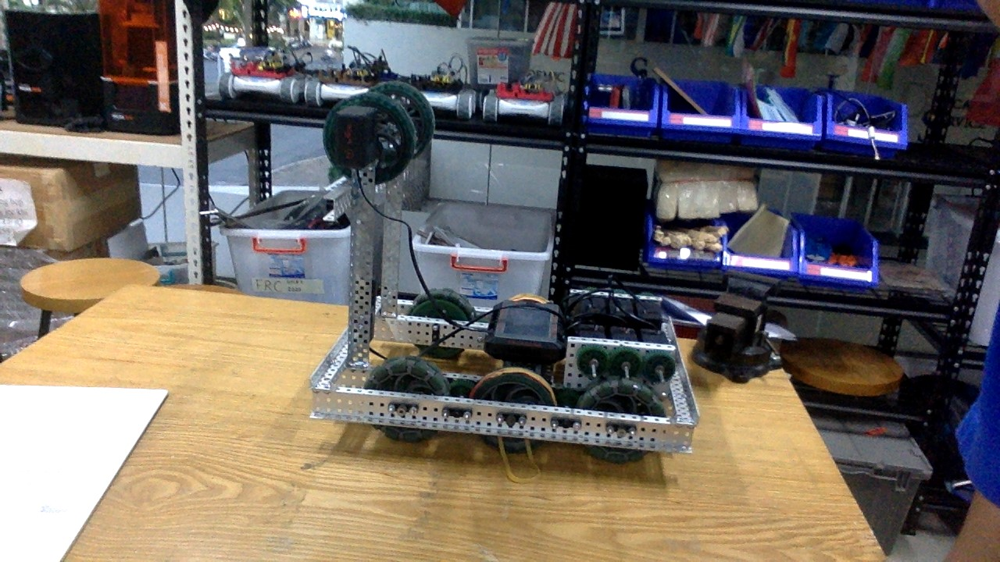
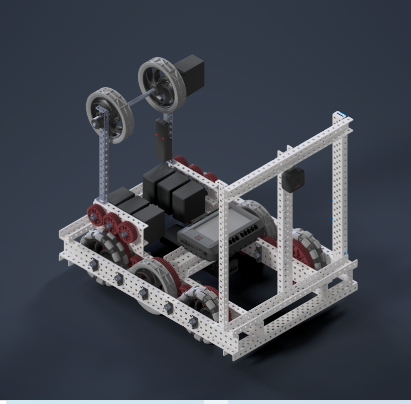
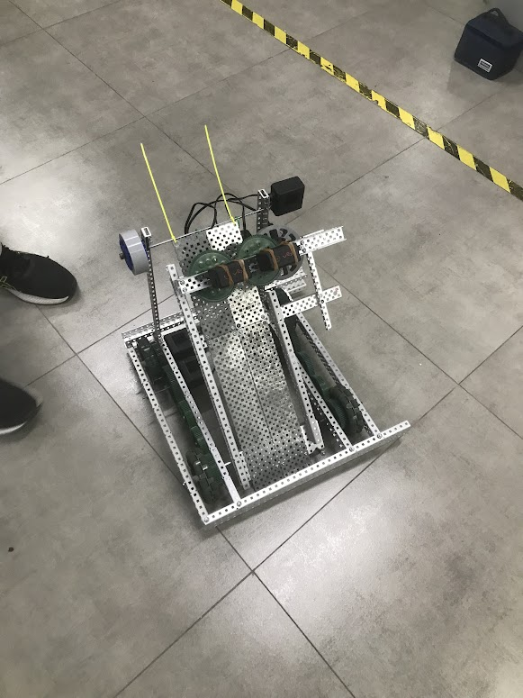
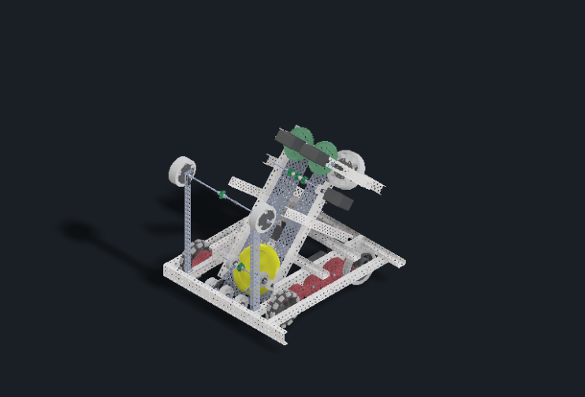
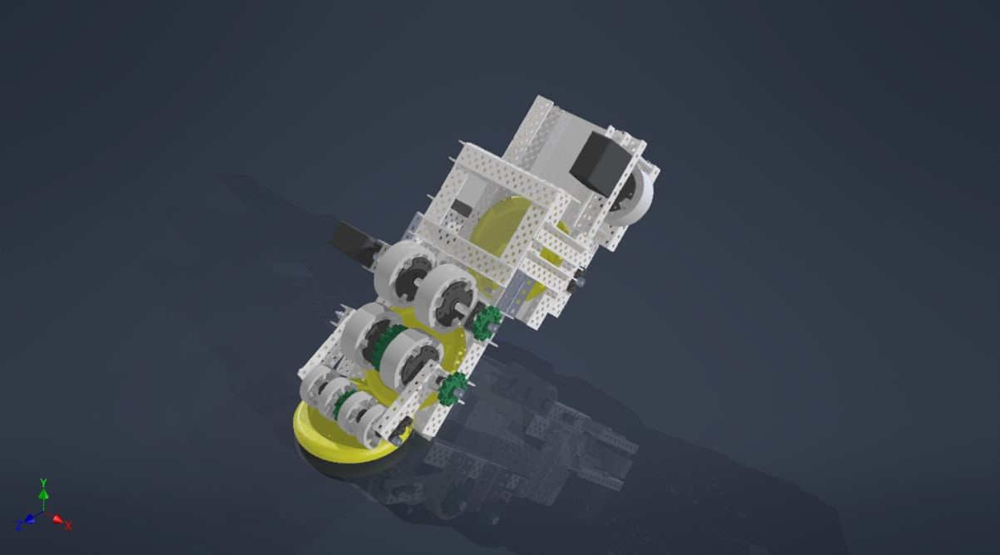
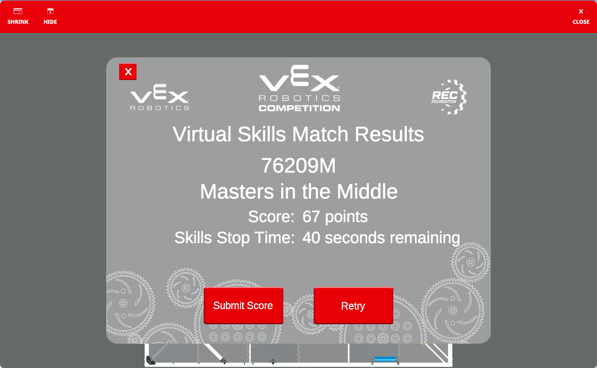
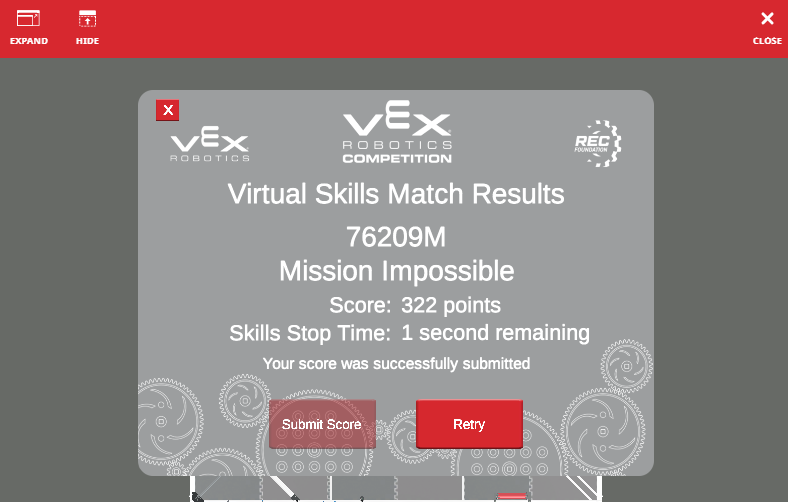

# Team 76209M - Mission Impossible

# The Team:

> Secretary of IMF: Alex Nguyen (Team Captain)

> William Brandt: Ben (Manager)

> Erika Sloane: Minseo (Documentation)

> Ilsa Faust: Chaewoo (Design and Decoration)

> Luther Stickell: Minjun (Design and Decoration)

> Benji Dunn: Daniel (Emotional Support)

> Ethan Hunt: Robot

# Robot

## Version 1 (Nationals)

## Version 2 (Skills)

## Version 3 (Shooter V1)
the photo is somewhere
## Version 4 (Worlds)

# Virtual Programming Skills

## Attempt 1:

67 points, not bad for a first try. Preload of 2 and starting position of E. I could just repeat what I'm doing untill the timer is done but the code currently is massively long and inefficent.

## Atempt 2

So I did what I said I wouldn't do. I just repeated what I did in Attempt 1. Good score though. 207.

## Attempt 3:

I got a bit carried away, I found out that one of the ways the save time is by barely picking a disc up while using gps to allow for more consistency.